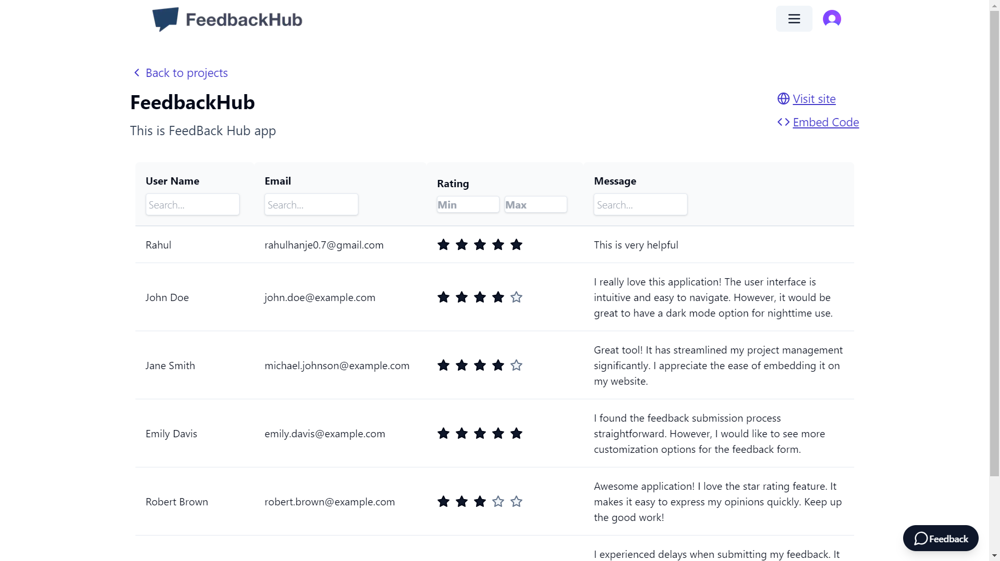

# feedbackHub

## Project Overview

ThefeedbackHub is a web application built with Next.js, Tailwind CSS, and Drizzle ORM. It provides a user-friendly interface for managing and interacting with projects, including:

- Creating new projects
- Viewing a list of existing projects
- Accessing project instructions
- Managing user subscriptions
- **Project Creation**: Users can create a project and receive an embeddable code to integrate into their websites.
- **Feedback Collection**: Website visitors can easily submit feedback along with ratings.
- **Feedback Management**: All feedback submitted through the embedded widget is viewable in the project's dashboard, with ratings displayed 
for easy review.Users can sort feedback by rating (from lower to higher) and search for specific feedback entries to streamline the review process.
- **UI Components**: Includes essential form components such as buttons, inputs, labels, popovers, and text areas.
- **Tailwind CSS Styling**: Provides a responsive and modern design using Tailwind CSS.
- **Supabase Integration**: Uses Supabase RPC for feedback submission and database management.
- **Popover Interaction**: The feedback form is displayed inside a popover triggered by a feedback button.

## Features

**User Authentication and Authorization:**

- Secure user authentication using Clerk.
- Role-based access control for different project functionalities.

**Project Management:**

- Create new projects with custom details.
- View a list of projects with filtering and sorting options.
- Access detailed project information, including instructions.

**Subscription Management:**

- Subscribe to the service to access premium features.
- Manage existing subscriptions and make payments.

**Database:**

- Data persistence using PostgreSQL and Drizzle ORM.
- Secure database connection and management.

**Front-End Technologies:**

- Next.js for server-side rendering and efficient front-end development.
- Tailwind CSS for rapid UI design and styling.
- Lucide React for icons and visual elements.

## Installation

1. **Clone the repository:**
   ```bash
   git clone https://github.com/Rahulhanje/feedbackHub.git
   ```

2. **Navigate to the project directory:**
   ```bash
   cd sass_dashboard
   ```

3. **Install dependencies using npm:**
   ```bash
   npm install
   ```

4. **Set up environment variables:**
   - Create a `.env` file in the root directory.
   - Add the following environment variables:
     ```
     NEXT_PUBLIC_CLERK_PUBLISHABLE_KEY=<your-clerk-publishable-key>
     NEXT_PUBLIC_STRIPE_PUBLISHABLE_KEY=<your-stripe-publishable-key>
     STRIPE_SECRET_KEY=<your-stripe-secret-key>
     DATABASE_URL=<your-database-url>
     ```

5. **Run the development server:**
   ```bash
   npm run dev
   ```

## Usage

Once the project is set up, you can access the application at `http://localhost:3000`.

**Creating a New Project:**

1. Login as a user.
2. Navigate to the "Create Project" page.
3. Fill in the required project details and submit.

**Viewing Projects:**

1. Login as a user.
2. Navigate to the "Dashboard" page.
3. View a list of all projects with filtering and sorting options.

**Accessing Project Instructions:**

1. Login as a user.
2. Select a project from the project list.
3. Navigate to the "Instructions" page.

**Managing Subscriptions:**

1. Login as a user.
2. Navigate to the "Payments" page.
3. Manage existing subscriptions, make payments, or subscribe to new plans.

## Contact Information

For any questions or issues, please contact:

- Email: rahulhanje0.7@gmail.com

